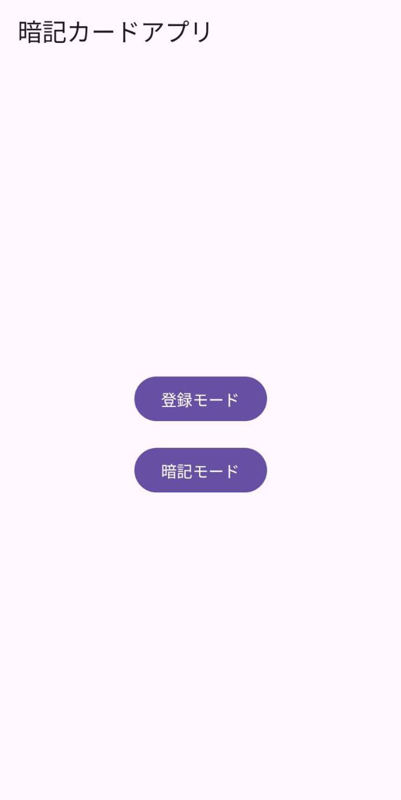
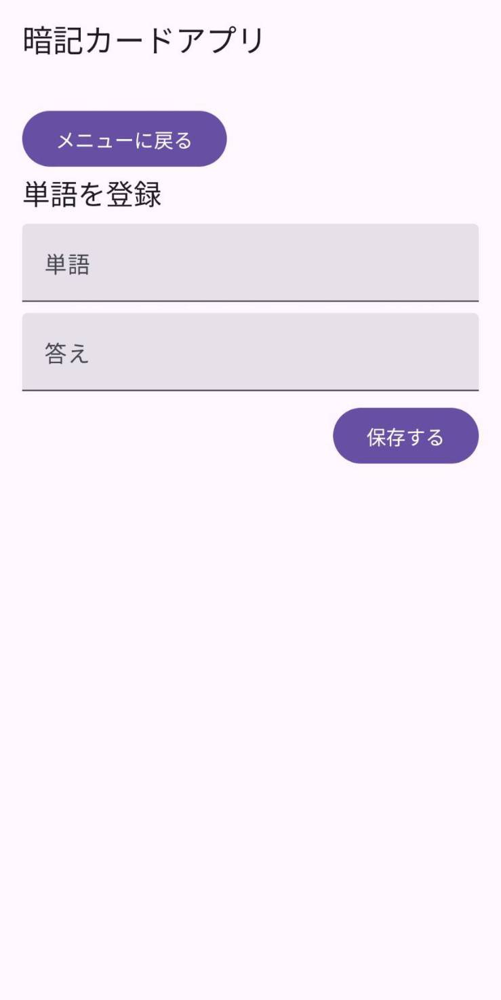
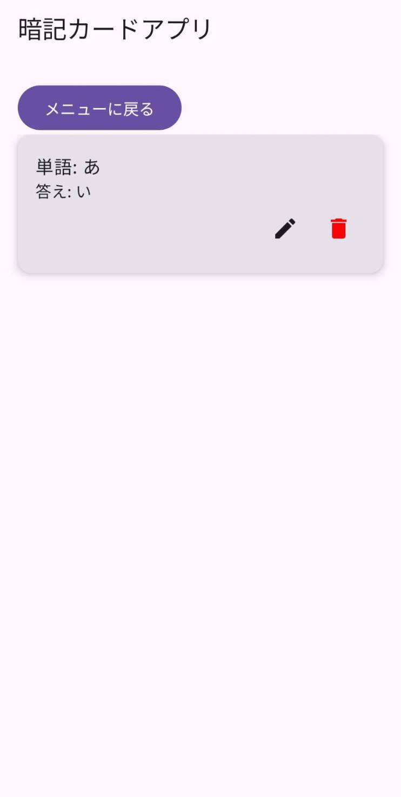

# FlashcardRPGProject(Alpha)
Webアプリ版『ShadowRogueDungeon』のデータ永続化問題を解決するために再構成された、
AndroidNativeの暗記カードアプリです。

## プロジェクトの背景：なぜWebからNativeへ？
当初はWebアプリ（WebView構成）での機能追加を検討していましたが、
実用化にあたり以下の技術的な壁に直面し、AndroidNativeへのフルスクラッチ開発を決断しました。

- データの揮発性リスク(LocalStorageの限界)
ブラウザのキャッシュクリアによって、蓄積した単語データが消失するリスクを排除できませんでした。

- サーバーコストの最適化
外部DBサーバーの構築・維持は、個人開発のスピード感とコスト（コスパ）に見合わないと判断しました。

- ローカル・ファーストの実現
Androidのファイルシステムに直接JSONファイルとして書き込むことで、オフラインでの高速動作と、データの完全な永続性を確保しました。

## 技術スタック
- Language:Kotlin2.x
- UIFramework:JetpackCompose(Material3)
- DataSerialization:kotlinx-serialization(JSON)
- Storage:InternalStorage(PhysicalFile)

## 主な機能
- **モード切替システム**:初期メニューから「登録」「暗記」の各モードへ遷移する、ゲームライクな状態管理。
- **インプレース編集**:暗記モード中に、リストから直接単語の修正・削除が可能。
- **永続化管理**:AppStorageManagerによるJSONエンコード/デコード処理。

## 今後の展望(Roadmap)
本プロジェクトは単なる暗記アプリで終わらず、元々のWebアプリ版『ShadowRogueDungeon』との統合を目指しています。

- **AdventureModeの移植**:Web版の冒険モードをNativeへ移植し、今回構築したJSONデータを共通基盤として使用。
- **学習のゲーミフィケーション**:単語の正解率や登録数が、冒険モードのキャラクターのステータスや攻略要素に直接影響を与えるハイブリッドな体験の実装。
- **OCR連携**:GoogleAppsScript等で構築したOCRツールと連携し、物理的な教材からのデータ取り込みを自動化。

## 画面類

