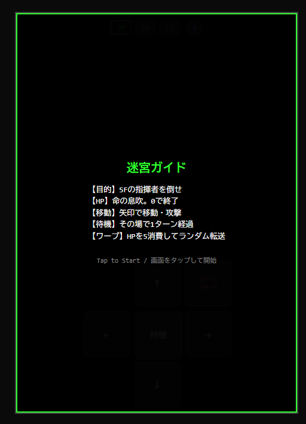
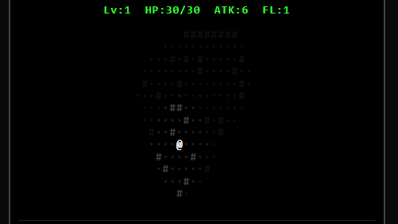
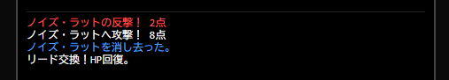
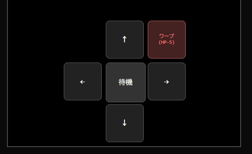
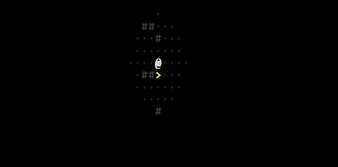
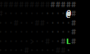
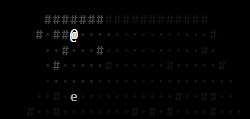
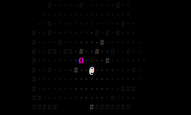
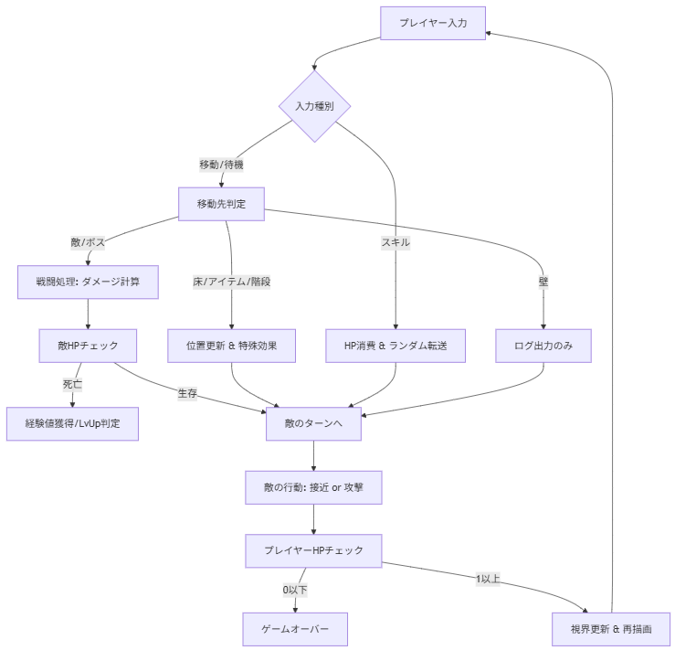
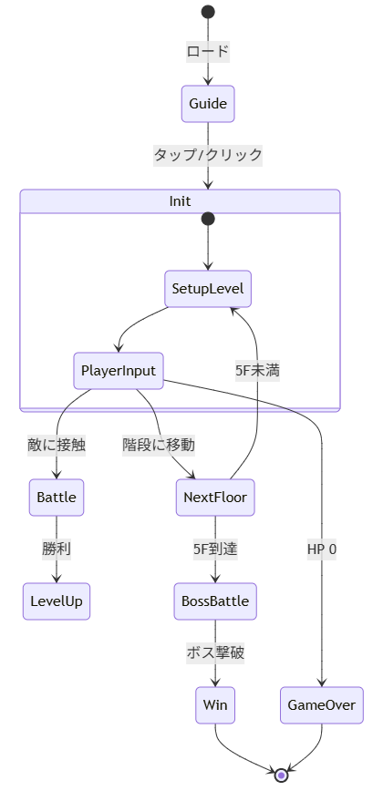

# ShadowRogueDungeon
マルチリンガル（日・英・西）に対応し、レトロなシンセサイザー音とBGMを搭載した、ブラウザで遊べる本格ローグライク・ミニゲームです。

# 遊び方ガイド
## 1. 起動方法
保存した index.html ファイルをブラウザで開くだけで、音と共に物語が始まります。
対応: PC（キーボード）、スマートフォン（タッチ操作）
推奨: 音声をONにして、ヘッドホン等でプレイすることをお勧めします。

## 2. 画面の構成
### 上部ステータスバー（HUD）
- **Lv / HP / ATK / FL:** あなたの現在の強さと階層を表示します。
- **BGMコントロール (NEW!):** 画面右上の「🔊/🔇」ボタンで、探索BGMのオンオフを切り替えられます。

**中央（メイン画面）:**
- **動的視界システム:** あなたの周囲数マス以外は暗闇です。歩くことで地形を記憶していきます。
- **インタラクティブ・サウンド:** 壁にぶつかった音、アイテムを拾った音など、すべてシンセサイザーでリアルタイム生成されています。

- **下部ログ:**
「攻撃した」「アイテムを拾った」などの行動結果がリアルタイムで表示されます。

- **矢印キー:**
プレイヤーの移動を制御します。
## 3. 操作方法
- **移動・攻撃:** 画面の 矢印ボタン または キーボードの矢印キー（WASD） を使用します。
- **待機 (WAIT):** 敵を引きつけたい時や、その場でターンを消費したい時に使用します。
- **ワープ (WARP):** 【今作の新要素】 HPを5消費して、フロア内のどこかへランダムに転送されます。囲まれた時の緊急脱出に有効です。

## 4. 記号（エンティティ）の説明
- 「@」 : 奏者（あなた）。
- 「·」 : 床。移動可能なエリアです。
- 「#」 : 壁。移動できません。
- 「>」 : 階段。次のフロアへ進みます。

- 「L」: リード（回復）。拾うとHPが12回復します。

- 「r, A, e」 : モンスター。階層が深くなるほど不協和音が増し、強力な個体が登場します。

- 「Ω」 : 古の指揮者（ボス）。5Fで待ち構える最終試練です。

## 5. ゲームの目的
モンスターとの戦闘を切り抜け、レベルを上げながら地下深くを目指してください。第5階層（5F）に君臨するボス「Ω」を撃破すればゲームクリア、伝説の奏者となります。

# 開発者向けガイド
## 1. 概要
アスキーアート風のグラフィックで構成されたダンジョン探索RPGです。
プレイヤーは @ を操作し、5階に潜むボス「古の指揮者」の撃破を目指します。

# 2. 主な機能
- **マルチリンガル対応:** ブラウザの言語設定を自動判別し、日本語・英語・スペイン語を切り替えます。
- **動的なマップ生成:** 階層移動のたびにランダムな地形と敵配置を生成します。
- **視界システム (Fog of War):** プレイヤーの周囲のみが明るく表示され、一度通った場所は「記憶」として薄暗く表示されます。
- **レベルアップシステム:** 敵を倒すことでステータスが向上します。
- **特殊スキル:** HPを消費してランダムな地点へワープできます。

# 3. 操作方法
- **移動・攻撃:** 方向キー、WASD、または画面上のボタン。
- **待機 (WAIT):** Space キー、テンキー 5、または WAIT ボタン。
- **ワープ:** 画面上の WARP ボタン。

# 4. 技術スタック
- **Language:** HTML5 / CSS3 / JavaScript (Vanilla JS)
- **Architecture:**
- **CONFIG:** ゲームバランス定数
- **i18n:** 言語リソースデータ
- **gameState:** ゲーム内変数の集中管理
- **handleInput:** 入力に対するターンベースのロジック制御

# ゲームサイクル・フロー図
1ターンの処理の流れを可視化しました。

### 状態遷移図（ゲーム開始から終了まで）

